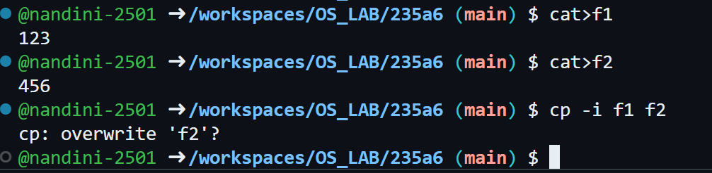

# BASIC UNIX COMMANDS PRACTISE OUTPUT
## GENERAL  COMMANDS OUTPUTS 
### DATE COMMAND OUTPUT
   
### DATE DATE COMMAND OUTPUT

### DATE TIME COMMAND OUTPUT

### DATE YEAR COMMAND OUTPUT

### DATE HOUR COMMAND OUTPUT

### DATE COMMAND MANUAL

### CAL COMMAND OUTPUT

### CAL YEAR COMMAND OUTPUT

### CAL MONTH COMMAND OUTPUT

### CAL COMMAND MANUAL

### WHO COMMAND OUTPUT 

### WHOAMI COMMAND OUTPUT

### WHO COMMAND MANUAL 

### TTY COMMAND OUTPUT -TERMINAL NAME-

### TTY COMMAND MANUAL

### UNAME COMMAND OUTPUT

### UNAME-R COMMAND OUTPUT

### UNAME-N COMMAND OUTPUT

### UNAME-N COMMAND MANUAL

### ECHO COMMAND OUTPUT

### ECHO COMMAND MANUAL

### ECHO $HOME COMMAND OUTPUT

### ECHO $ COMMAND MANUAL 

### BC - BASIC CALCULATOR COMMAND OUTPUT

### BC - BASIC CALCULATOR COMMAND MANUAL

## IP FILE COMMANDS
### HISTORY COMMAND OUTPUT

### HISTORY COMMAND MANUAL 

### EXIT COMMAND OUTPUT

### EXIT COMMAND MANUAL

## DIRECTIORY COMMANDS
### PWD COMMAND OUTPUT

### PWD COMMAND MANUAL

### MKDIR COMMAND OUTPUT

### MKDIR COMMAND MANUAL

### CD COMMAND OUTPUT

### CD2 COMMAND OUTPUT

### CD SUBDIR COMMAND OUTPUT

### CD.. COMMAND OUTPUT

### CD COMMAND MANUAL

### RMDIR COMMAND OUTPUT

### RMDIR COMMAND MANUAL

## FILE COMMANDS
### CAT COMMAND OUTPUT

### CAT1 COMMAND OUTPUT

### CAT >> FILENAME COMMAND OUTPUT

### CAT COMMAND OUTPUT

### CAT COMMAND MANUAL 

### CP -I COMMAND OUTPUT

### CP -R COMMAND OUTPUT

### CP COMMAND MANUAL

### MV OLD NEW COMMAND OUTPUT

### MV COMMAND MANUAL

### RM FILE COMMAND OUTPUT

### RM -R * COMMAND OUTPUT

### RM COMMAND MANUAL

### LS COMMAND OUTPUT

### LS NAME COMMAND OUTPUT

### LS NAME * COMMAND OUTPUT

### LS - A COMMAND OUTPUT

### LS -R COMMAND OUTPUT

### LS - L COMMAND OUTPUT

### LS COMMAND MANUAL

### CMP FILE COMMAND OUTPUT

### CMP COMMAND MANUAL

### CHMOD 740 FILE COMMAND OUTPUT

### CHMOD COMMAND MANUAL

